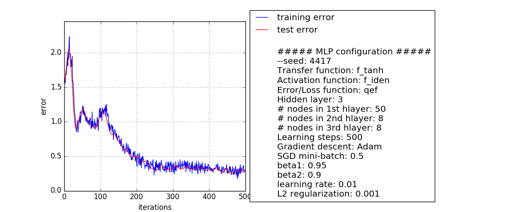

# MMLP v0.31
MMLP is manually coded multilayer perceptron / neural network.  
  
Mainly initiated for learning python(3) and the math behind some mechanics used in neural networks, the project grow to a useful tool for simple classification/regression tasks and getting an intuition on about the effects of hyperparameter choice.

A simple GUI is available, so little to no programming knowledge is required to get your hands dirty with some neural networks.
## how to use  
1. clone repo  
2. open console:
```python mmlp.py```

NOTE: works on windows, to use on ubuntu(etc.) toggle line comment for "mmlp.ico" 
## Features  
Features implemented so far:
* loading/saving data (data, weights, label)
* 1-, 2-, 3- hidden layer network
  * free choice for number of nodes in each layer
  * classification and regression
* full hyper-parameter control:
  * Error-/Lossfunciton
    quadratic  
    pseudo huber loss  
    binary cross entropy  
  * Activation function (out layer activation) / Transfer function (activation for all units except the out layer)
    tanh  
    atan  
    logistic  
    softplus  
    relu  
    bent identity  
    binary  
    stochastic  
  * Gradient descent optimizer
    vanilla gradient descent
    Adam / RMSprop  
    SGD (minibatch)  
    learning rate  
  * Regularization  
    Droptout  
    L2/L1 norm  
* PCA
  * to reduces the input dimensions
* Autoencoder 
  * saves autoencoded data and weights  
  
  


